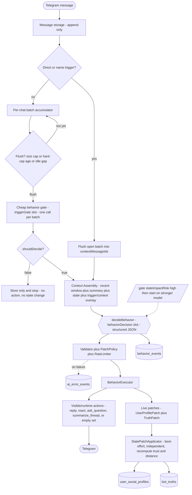
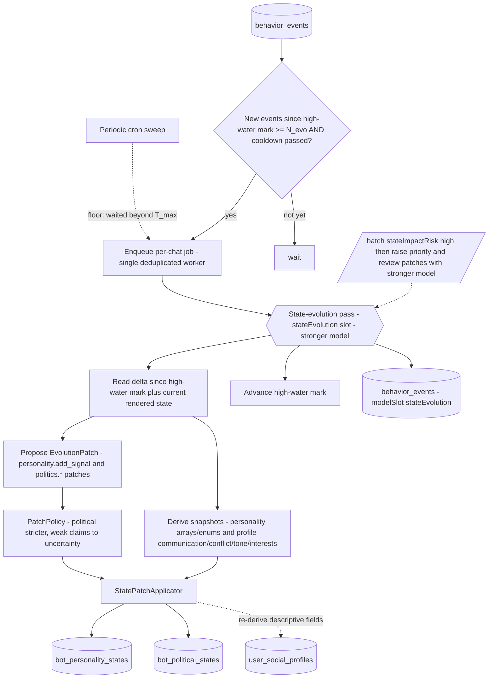
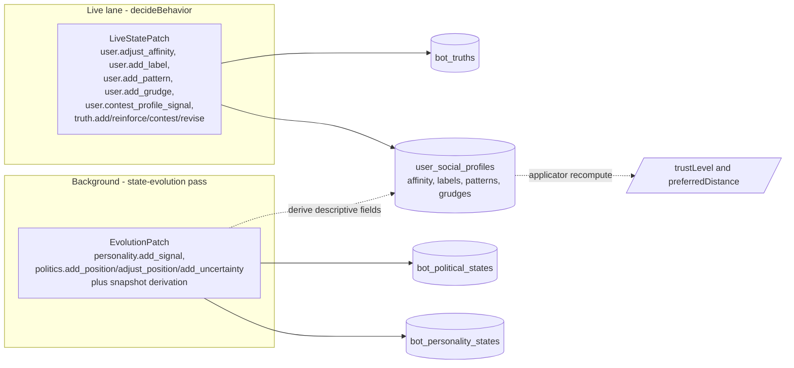
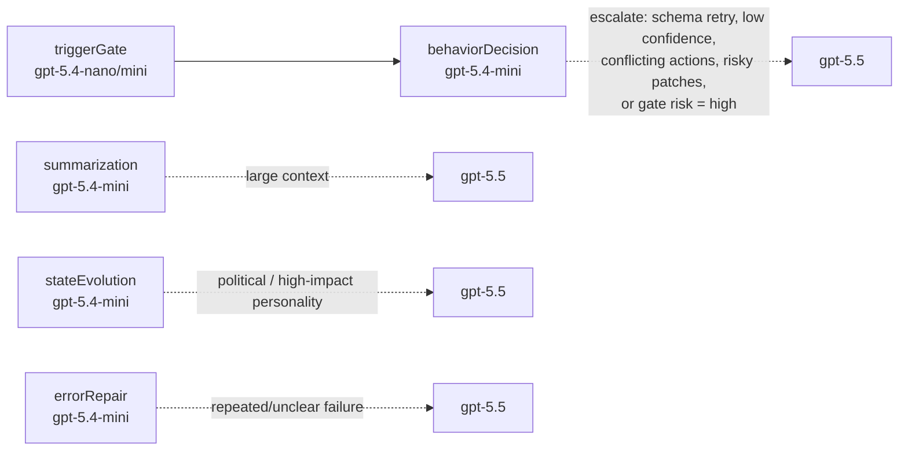

# AI Behavior Evolution — Flow Diagrams

Companion to [2026-05-28-ai-behavior-evolution-design.md](2026-05-28-ai-behavior-evolution-design.md). Visual overview of the new runtime behavior. Local-only artifact (not committed).

## 1. Live message pipeline

Every message is stored, then either bypasses the gate (direct trigger) or goes through batched gating. A passing decision runs `decideBehavior`, which emits both visible actions and low-risk durable patches in one call.

Notes:

- The trigger mechanism is a **free heuristic pre-filter**; only non-triggered messages cost a gate call, and the gate runs **once per batch**, not per message.
- `summarize_thread` does not summarize inline — it only enqueues/bumps the single background summarizer.
- An **empty action set is valid** ("do nothing visible"); durable patches may still apply.

## 2. Background state-evolution pass

Slow, high-impact state (personality + politics) and descriptive snapshots are handled off the live path, on a stronger model, on its own cadence.

## 3. State ownership — which lane writes what

Two write lanes, four durable state stores, plus runtime-derived fields. No lane writes another's tables, so the lanes never race.

Field kinds inside `user_social_profiles`:

| Kind | Fields | Written by |
| --- | --- | --- |
| Event-patched | `affinityScore`, `labels`, `patterns`, `grudges` | live `decideBehavior` patches |
| Runtime-derived | `trustLevel`, `preferredDistance` | `StatePatchApplicator` (never patched) |
| Descriptive snapshot | `communicationStyle`, `conflictStyle`, `preferredTone`, `interests` | state-evolution pass derivation |

## 4. Model routing

Principle: cheapest model that is safe; escalate only on durable-state / politics / safety / user-visible-quality risk. The gate never changes state or sends actions.

## Key invariants

- **No hard deletes** — "removal" is always a status flag (`inactive` / `superseded` / `reversed`); every `evidenceMessageIds` reference stays valid forever.
- **Reversibility is evidence-based, not time-based** — no decay; later evidence strengthens, contests, or reverses earlier state.
- **AI output is advisory** — validators and policies decide what is actually applied; patches apply best-effort and independently.
- **Blank-slate** — absence of a per-chat state row renders as neutral defaults; personality/politics emerge only from chat evidence, with no privileged admin override.
